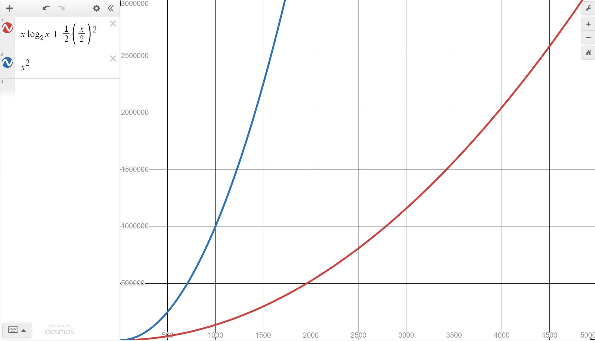
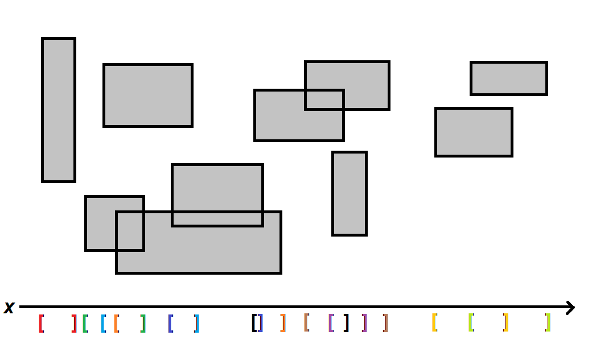

An important part of game engines and various geospatial software is the notion
of overlap between objects. Objects are represented using data (in games
entities have a position and a collision shape, while in databases entities are
multimodal data points). We want to find collision between these objects, or to
search for nearest neighors of any single object.

The obvious solution of scanning every pair (or every n-tuple) is too slow for
real world data, and so we need to find a way to quickly prune false negatives
or group potential candidates together. I will cover some of these solution in
this article.

### Metric spaces 

We are all adults here so let's formalize things.
A _metric space_ is a set of objects $M$, which can be anything,
and a distance function $d : M \times M \to \mathbb{R}$.
So if you have a set of any _thing_ of some type, 
and you can define a "distance" between any two things, you've got a metric space.
The distance function is called a _metric_, and you use this metric to measure
things beyond the distances between two objects in the set.
The metric must satisfy these properties:
- $d(x, x) = 0$
- $d(a, b) > 0, \quad a \neq b$
- $d(a, b) + d(b, c) \ge d(a, c)$

The Euclidean space is a classic example of a metric space. It's how we percieve
the world, it's what games use, and it's what we normally think of when we say
"space".

In more complicated scenarios where you have data of different type and none of
them represent position in real space, you have to get creative. But as long as
you can measure the distance between these two objects and this measure satisfies
the above properties, it's a metric space, no matter how unintuitive the measure
function itself may be.

This article will deal with the Euclidean space because it's primarilly written
for game engines and because it's easy and intuitive to visualize.

### Problem formulation

Let _entity_ be a type representing an object in two-dimensional Euclidean space
with a volume larger than $0$. I've picked two dimensions for simplicity. Having
a volume larger than $0$ just means that the entity has a shape and is not an
inifnitely small point. Such an entity is often called a particle and they
simplify things, but are not practial in the general sense.

The task is to find the set of pairs of entities $e_1, e_2$ whose volumes are
intersecting. This may vaguely resemble collision detection, but the entities'
velocities are ignored. We are only interested in answering this question:
_which entities are intersecting right now?_

Depending on your use case, this pair of entities can be ordered (2-tuple) or
unordered (binary set). Game engines normally deal with unordered pairs because
there's no need to process the same collision twice. In this article we
talk about unordered pairs $\\{e_1, e_2\\}$.

We know ahead of time which entity pairs can be elements of the resulting set.
Any entity can be paired up against any other entity (except for itself), so if
we have $n$ entities, the total number of possible pairs is \binom{n}{2}$.

It's important to establish the concept of _bounding volumes_. Take a look at
the image below. If every entity in the scene is a star, then checking for star
intersection would require a sophisticated intersection algorithm like
Separating Axis Test.

 

Percise intersection checks are part of the _narrow phase_ in collision
detection. This article deals with the _broad phase_. It's very wasteful to
always perform precise intersection algorithms on the exact shapes. We can purge
false positives by first checking for intersection of the entities' _bounding
volumes_. These volumes are often very primitive and efficient to construct and
check for intersection against.

 

Axis-aligned rectangles or circles have an $O(1)$ intersection algorithm, and
their construction is $O(N)$ for the number of points $N$ in the entity's
volume. Commonly, we can compute the bounding volume ahead of time and assume it
changes only when the entity scales, rotates or the bounding volume itself
transforms. Game engines tend to not allow the latter case, as most shapes are
aassumed to be rigid i.e. undeformable.

This article uses axis-aligned rectangles for the bounding volumes. Circles are
more efficient for shapes with a similar span in both axes, otherwise ellipses
can be used. However, the strategies discussed in this article mostly deal with
the very edge of an entity's volume in the $x$ or $y$ axis, and so it seems
natural to go with rectangles.

### Naive approach

The simplest solution to this problem is to iterate through all possible pairs
of entities and check if their bounding volumes intersect. This approach scales
poorly: we perform $\binom{n}{2}$ comparisons in $O(n^2)$ time. Despite its poor
performance, this brute force approach can be used as a baseline for checking
the correctness of other strategies.

To develop an intuition on how we can improve on this, take a look at the image
below. Can you see how the rectangles have been placed in such a way that they
naturally form two big clusters?

 

It seems obvious that no rectangle from the left cluser can intersect with any
rectangle from the right cluster. What if we processed these clusters
separately? There are $7$ rectangles in the first cluster and $8$ in the second.
It would take $\binom{7}{2} + \binom{8}{2} = 49$ checks, compared to the
standard $\binom{15}{2} = 105$.

To obtain these clusters, we'd sort the rectangles along the $x$ axis and draw a
line between the two adjacent rectangles with the furthest distance along the
$x$ axis. Sometimes it may be better to split along the $y$ axis instead. We can
determine the better axis in linear time by computing the variance along each
axis. In an ideal case, this amounts to $n\log(n) + \frac{n^2}{2}$. That's
$O(n^2)$, sure, but look at this graph:

In a realistic and practical scenario, the number of entities in a game will not
approach anywhere near infinity. If we had $5000$ entities, we would save
approx. $2 \cdot 10^7$ comparisons. That's a non-trivial amount. While $N=5000$
is good enough for games, if we're scanning through a database with millions of
entries, the gains diminish fast. We cannot always discard the theoretical limit
in favor of the practical limit. Furthermore, there are two big issues with this
approach in general.

1) it doesn't work if the rectangles don't form two disjoint clusters
2) it doesn't work if the clusters are unbalanced

By finding a smarter and more general approach to grouping likely candidates,
these two problems can be eliminated.

### Sweep and prune

Sweep and prune (a.k.a. sort and sweep) is a classic algorithm for broad phase
collision detection. It works by sorting the bounding volumes and pruning all
candidates which are guaranteed not to intersect.

I will first describe a weaker algorithm from which sweep and prune can then be
developed. The basis for this algorithm is the same as sweep and prune. First,
we sort all the objects (bounding volumes) along one of the axes. For
illustration purposes I'll stick with the $x$ axis. Then, for each object, we
find the lower bound right edge and upper bound left edge volume. Everything in
between those two is a collision candidate for our object. Seems simple enough,
but we need to be careful on how to sort the objects and how to find the bounds.

For example, let's have an arrangement of objects like in the image below. We
have sort the objects on the x axis according to some modification of the metric
function $d^\prime : M \to \mathbb{R}$. In this example, I've used the $x$
coordinate of the object's left edge. Below the objects is an axis line where
you can clearly see the projection of the left edge. The numbers represent
ordering of the objects, not axis units.

The second part of the algorithm is to find candidates for each object. Observe
the 6th object which has been highlighted in the image. In the brute force approach,
we scan through the entire set of objects. This time around, we can take advantage
of the fact that the objects are sorted by their left edge. 

When we sort things, an invariant is established: if a number $k$ is the $i$-th
element of the list, then all elements to the right (at position $i+1, i+2, ...,
n$) are greater or equal than $k$, and all elements to the left (at position
$i-1, i-2, ..., 1$) are smaller or equal than $k$. This is the basis for binary
search and this is what we use to quickly find the upper bound. 

What is the upper bound in our example? It's the first object whose left edge is
bigger than the 6th object's right edge (9). We use binary search to find this
object in $O(logn)$.

What about the lower bound? It's the first object whose right edge is smaller
than the 6th object's left edge (3). We can't do binary search here because the
invariant doesn't guarantee anything about the right edge of objects being
ordered. We have two options: sort by the right edge as well, or do a linear
scan for the lower bound. The first approach is tricky, while the second
approach decays into $O(n)$.

Once we find the upper and lower bound, everything in between is a candidate for
middle phase collision (check which rectangles are really intersecting) and
narrow phase collision (use the actual shapes instead of bounding volumes). The
running time of this pseudo-sweep and prune algorithm is still $O(n^2)$, but the
average case yields better performance than the naive approach. Furthermore,
if we can assume temporal coherence (more on that below), then the amortized runtime
can be reduced to $\mathcal{O}(nlogn)$.

---

Now let's look at the real sweep and prune algorithm. The key idea behind sweep
and prune is not to sort objects by their left or right edge, but to sort both
edges together. 

Let's solve a simpler, more isolated problem first. Imagine you are given a
string `s` where each character is either an opening bracket `[` or a closing
one `]`. An interval is uniquely defined by an opening bracket and a closing
bracket. Find all intersections between intervals. For example, if `s` is
`[[]][[][]][]` then there are $3$ intersections.  
Firstly, observe that the answer is unique assuming `s` is well formed. Even in
cases like `[[]]` where we could either have a large interval enclosing a
smaller one, or two equaly sized intervals intersecting, the answer stays the
same. This problem is solved using a stack. We linearly scan through the string
and on each occurrence of `[`, we increase the result by the stack size and push
`[` onto the stack. On each occurrence of `]`, we pop from the stack.

The next iteration of this problem requires us to retrieve all intersections.
Each interval is numbered $1, 2, 3, ...$ and the algorithm should output a list
of pairs $(i, j), i < j$. Notice first that we must be provided with the
interval ordering or else the solution cannot be unique. Indeed, the input is
`[[][]]` has different possible solutions: $\\{(1,2), (1,3)\\}, \\{(1,2),
(2,3)\\}$. So let's assume that the input is a list of pairs `(char, int)`. To
solve this problem, we keep a stack of integers denoting unclosed intervals
scanned so far, and on each `('[', k)`, we append `(k_i, k)` to the result,
where `k_i` is the $i$-th element of the stack. This is the optimal solution to
this problem and it has a worst-case running time of $O(n^2)$, though on average
it's $O(n)$.

Sweep and prune generalizes this approach. Let edge be a triple 
$(x, v, c) | x\in \mathbb{R}, v \in \mathbb{N}, c \in \\{0,1\\}$ 
representing the edge's coordinate $x$, a unique identifier for 
the volume or object $v$ which the edge belongs to, and a boolean 
$c$ for the edge is opening (lower, leftmost, $0$) or closing 
(upper, rightmost, $1$). We create a list of edges by mapping
each object into two of these edge tuples. Then, we sort the list 
by $x$ and perform the algorithm described above.

See the image below. Time time we aren't querying each object individually, and
instead we're doing a linear pass through the list and generating all results at
once.

The performance of sweep and prune is $O(nlogn + k)$ where $k$ is the maximum
number of pairs. In the worst case it's $\binom{n}{2}$, but the worst case is
almost never occurs, and $k$ is usually $O(n)$, so the running time is
approximated to $O(nlogn)$. This can be further improved. A lot of processing
time is wasted on sorting the array at each invocation of the algorithm. Think
about temporal coherence: between two calls of the algorithm (usually two
adjacent frames in a game), the objects will not move much far because their
velocities are usually much smaller than the perimiter of their bounding
volumes. Therefore, the sorted list will not change much. In other words, we can
assume the list will remain partially sorted, and thus we should use an adaptive
sorting algorithms like insertion sort, which have a $O(n)$ running time for
partially ordered lists. We can't always rely on this, especially on the very
first frame, but if temporal coherence is assumed (which is the case in most
video games), then the amortized running time for sweep and prune is
$\mathcal{O}(n)$.