An important part of game engines and various geospatial software is the notion
of overlap between objects. Objects are represented using data (in games
entities have a position and a collision shape, while in databases entities are
multimodal data points). We want to find collision between these objects, or to
search for nearest neighors of any single object.

The obvious solution of scanning every pair (or every n-tuple) is too slow for
real world data, and so we need to find a way to quickly prune false negatives
or group potential candidates together. I will cover some of these solutions in
this article.

### Metric spaces 

We are all adults here so let's formalize things.
A _metric space_ is a set of objects $M$, which can be anything,
and a distance function $d : M \times M \to \mathbb{R}$.
So if you have a set of any _thing_ of some type, 
and you can define a "distance" between any two things, you've got a metric space.
The distance function is called a _metric_, and you use this metric to measure
things beyond the distances between two objects in the set.
The metric must satisfy these properties:
- **p.1**$\quad d(x, x) = 0$
- **p.2**$\quad d(a, b) = d(b, a)$
- **p.3**$\quad d(a, b) > 0, \quad a \neq b$
- **p.4**$\quad d(a, b) + d(b, c) \ge d(a, c)$

The Euclidean space is a classic example of a metric space. It's how we percieve
the world, it's what games use, and it's what we normally think of when we say
"space":

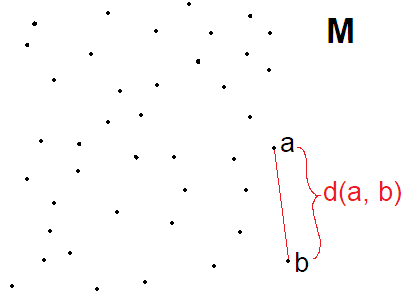

In more complicated scenarios where you have data of different type and none of
them represent position in real space, you have to get creative. But as long as
you can measure the distance between these two objects and this measure satisfies
the above properties, it's a metric space, no matter how unintuitive the measure
function itself may be.

This article will deal with the Euclidean space because it's primarilly written
for game engines and because it's easy and intuitive to visualize.

What does _intersection_ mean in the context of metric spaces? All elements in
a metric space are points so they don't have a shape. Without a shape, we can't
talk about intersection. Overlap of two distinct points is not possible because
$d(a, b) = 0 \xRightarrow{\text{p.1}} a = b$.
 
We cannot work on metric spaces alone. A ball $B$ of radius $r$ centered at $c
is a subset of the metric space defined like so:

$$B(c, r) = \\{ x \in M \mid d(c, x) < r \\} $$

A line segment is a set of points which we can define with a parametric equation:

$$L(a, b) = \\{ (1 - t)a + tb \mid t \in [0, 1] \\}$$

See the image below. I didn't even touch up on the subject of boundaries: a ball
may or may note include its boundary ($d(c, x) \leq r$ or $d(c, x) < r$).
Usually balls are "open" meaning the boundary isn't included. But for our line
definition, we said $t \in [0, 1]$ which includes the endpoints $a$ and $b$. In
pracice, we never really deal with continuous spaces because of natural
limitations of hardware, so this problem is eliminiated by sacrificing precision.

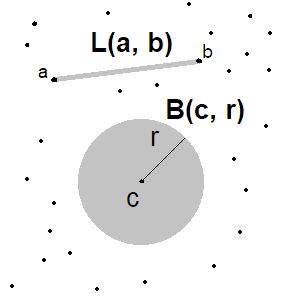

Polygons are tricky: we start with a union of line segments such that each endpoint
belongs to exactly $2$ line segments (like a closed chain):

$$P(p_1, p_2, ..., p_n) = L(p_1, p_2) \cup L(p_2, p_3) \cup ... \cup L(p_{n-1}, p_n)$$

That's only for the polygon boundary; what about the interior? Well, we need to
define what an interior is. Take a look at the image below:

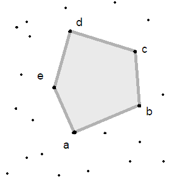

Why do we know that the shaded area is the interior of $P(a,b,c,d,e)$? There isn't
enough information right now to make this assumption. Jordan curve theorem states
that an interior and exterior will always exist, but determining which is which
is up to us. This is where the concept of _orientation_ comes in. Normally we
define all points in a clockwise or counter clockwise order. Once we do that,
a polygon with its interior can be defined as:

$$P(p_1, p_2, ..., p_n) = \\{ k_1p_1 + k_2p_2 + ... + k_{n}p_{n} \ge 0 \mid \sum_{i=1}^{n} k_i = 1 \\}$$

which is just a generalization of the line segment definition.

Intersection of shapes becomes intersection of sets. There is an intersection
between shapes $A$ and $B$ if $A \cap B \neq \varnothing$. We can't compute
these set intersections because there is an infinite amount of points in any
shape. Instead, we rely on analytic solutions or clever vector formulas to come
to a conclusion.
 
Determining the intersecting region in the general sense is not possible (for
polygons we could use clipping algorithms), but that's not an issue because in
game physics we only care about the normal vector of the intersection,
intersection depth projected along that normal vector and a finite set of
clipping points (in 2D it's usually $2$ points at most). This is a topic for
narrow phase collision, though.

All this talk about metric spaces, and yet the rest of this article will deal
with vectors, trees and a bunch of `if` statements, so why bother? I wanted to
help build an intuition on how these algorithms and data structures came to be.
Much of the work here can be visualized and the correctness of this visualiation
depends on understanding first principles which, for in this article, are metric
spaces. By formalizing what's otherwise considered common knowledge, we can
eliminate hand-wavy logic. Just by having you think about what happens when
_shapes_ become infinitely big or small, or what happens when two _shapes_ are
infinitely far away, you can start to appreciate why the assumptions are valid,
or at the very least _feel_ valid.

### Problem formulation

Let _entity_ be a type representing an object in two-dimensional Euclidean space
with a volume larger than $0$. I've picked two dimensions for simplicity. Having
a volume larger than $0$ just means that the entity has a shape and is not an
inifnitely small point. Such an entity is often called a particle and they
simplify things, but are not practial in the general sense.

The task is to find the set of pairs of entities $e_1, e_2$ whose volumes are
intersecting. This may vaguely resemble collision detection, but the entities'
velocities are ignored. We are only interested in answering this question:
_which entities are intersecting right now?_

Depending on your use case, this pair of entities can be ordered (2-tuple) or
unordered (binary set). Game engines normally deal with unordered pairs because
there's no need to process the same collision twice. In this article we
talk about unordered pairs $\\{e_1, e_2\\}$.

We know ahead of time which entity pairs can be elements of the resulting set.
Any entity can be paired up against any other entity (except for itself), so if
we have $n$ entities, the total number of possible pairs is $\binom{n}{2}$.

It's important to establish the concept of _bounding volumes_. Take a look at
the image below. If every entity in the scene is a star, then checking for star
intersection would require a sophisticated intersection algorithm like
Separating Axis Test.

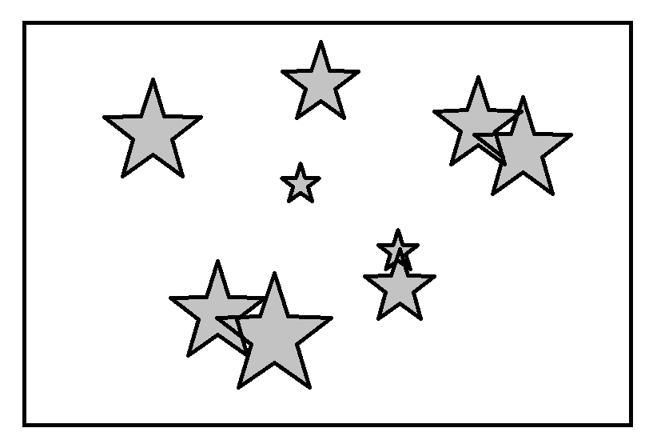 

Percise intersection checks are part of the _narrow phase_ in collision
detection. This article deals with the _broad phase_. It's very wasteful to
always perform precise intersection algorithms on the exact shapes. We can purge
false positives by first checking for intersection of the entities' _bounding
volumes_. These volumes are often very primitive and efficient to construct and
check for intersection against.

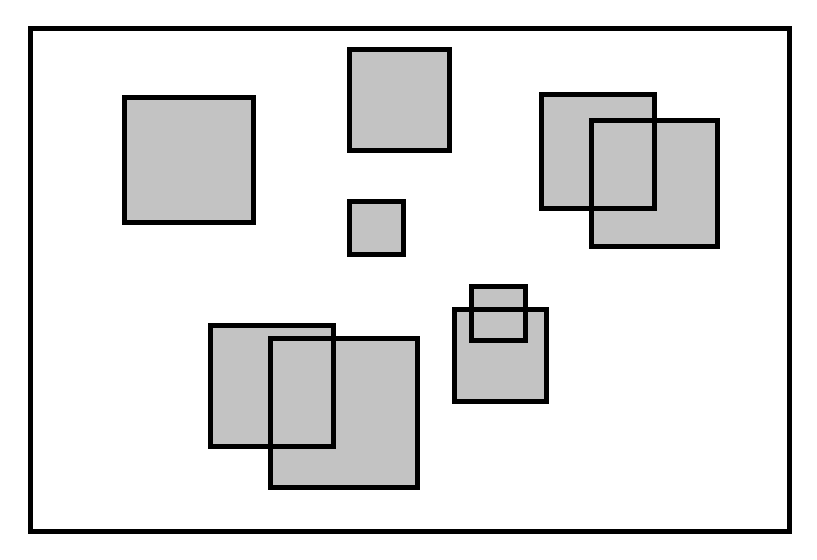 

Axis-aligned rectangles or circles have an $O(1)$ intersection algorithm, and
their construction is $O(N)$ for the number of points $N$ in the entity's
volume. Commonly, we can compute the bounding volume ahead of time and assume it
changes only when the entity scales, rotates or the bounding volume itself
transforms. Game engines tend to not allow the latter case, as most shapes are
aassumed to be rigid i.e. undeformable.

This article uses axis-aligned rectangles for the bounding volumes. Circles are
more efficient for shapes with a similar span in both axes, otherwise ellipses
can be used. However, the strategies discussed in this article mostly deal with
the very edge of an entity's volume in the $x$ or $y$ axis, and so it seems
natural to go with rectangles.

### Naive approach

The simplest solution to this problem is to iterate through all possible pairs
of entities and check if their bounding volumes intersect. This approach scales
poorly: we perform $\binom{n}{2}$ comparisons in $O(n^2)$ time. Despite its poor
performance, this brute force approach can be used as a baseline for checking
the correctness of other strategies.

To develop an intuition on how we can improve on this, take a look at the image
below. Can you see how the rectangles have been placed in such a way that they
naturally form two big clusters?

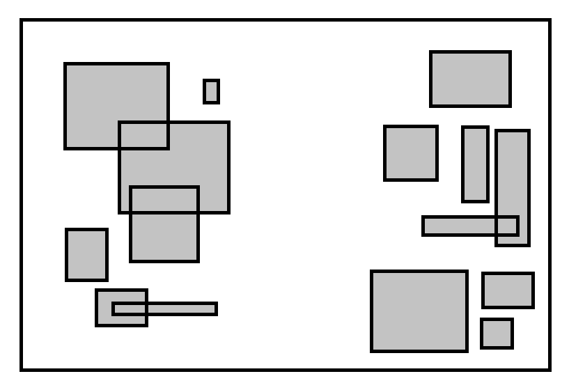 

It seems obvious that no rectangle from the left cluser can intersect with any
rectangle from the right cluster. What if we processed these clusters
separately? There are $7$ rectangles in the first cluster and $8$ in the second.
It would take $\binom{7}{2} + \binom{8}{2} = 49$ checks, compared to the
standard $\binom{15}{2} = 105$.

To obtain these clusters, we'd sort the rectangles along the $x$ axis and draw a
line between the two adjacent rectangles with the furthest distance along the
$x$ axis. Sometimes it may be better to split along the $y$ axis instead. We can
determine the better axis in linear time by computing the variance along each
axis. In an ideal case, this amounts to $n\log(n) + \frac{n^2}{2}$. That's
$O(n^2)$, sure, but look at this graph:

In a realistic and practical scenario, the number of entities in a game will not
approach anywhere near infinity. If we had $5000$ entities, we would save
approx. $2 \cdot 10^7$ comparisons. That's a non-trivial amount. While $N=5000$
is good enough for games, if we're scanning through a database with millions of
entries, the gains diminish fast. We cannot always discard the theoretical limit
in favor of the practical limit. Furthermore, there are two big issues with this
approach in general.

1) it doesn't work if the rectangles don't form two disjoint clusters
2) it doesn't work if the clusters are unbalanced

By finding a smarter and more general approach to grouping likely candidates,
these two problems can be eliminated.

### Sweep and prune

Sweep and prune (a.k.a. sort and sweep) is a classic algorithm for broad phase
collision detection. It works by sorting the bounding volumes and pruning all
candidates which are guaranteed not to intersect.

I will first describe a weaker algorithm from which sweep and prune can then be
developed. The basis for this algorithm is the same as sweep and prune. First,
we sort all the objects (bounding volumes) along one of the axes. For
illustration purposes I'll stick with the $x$ axis. Then, for each object, we
find the lower bound right edge and upper bound left edge volume. Everything in
between those two is a collision candidate for our object. Seems simple enough,
but we need to be careful on how to sort the objects and how to find the bounds.

For example, let's have an arrangement of objects like in the image below. We
have sort the objects on the x axis according to some modification of the metric
function $d^\prime : M \to \mathbb{R}$. In this example, I've used the $x$
coordinate of the object's left edge. Below the objects is an axis line where
you can clearly see the projection of the left edge. The numbers represent
ordering of the objects, not axis units.

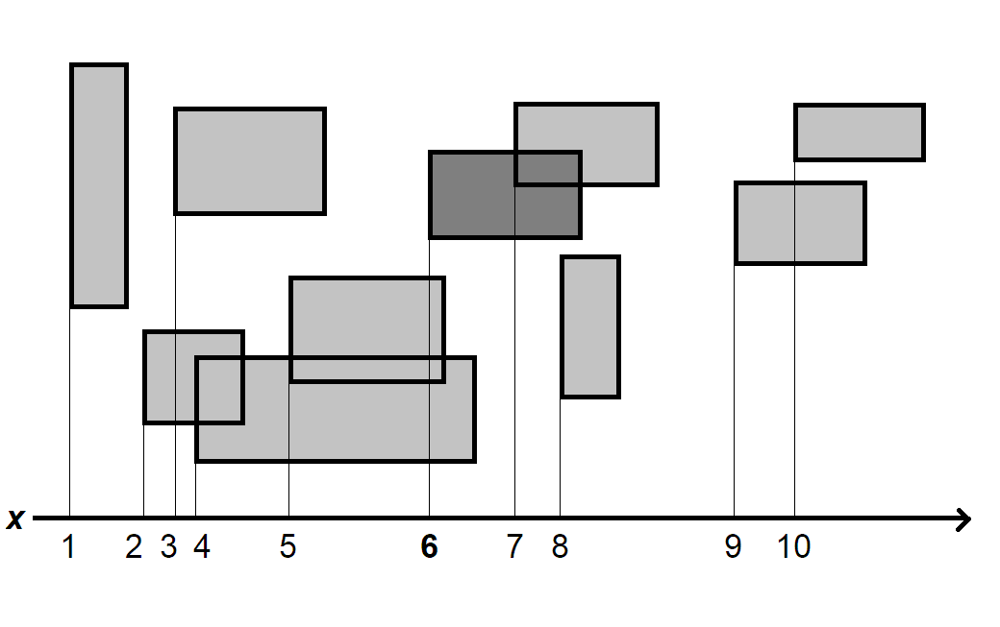

The second part of the algorithm is to find candidates for each object. Observe
the 6th object which has been highlighted in the image. In the brute force approach,
we scan through the entire set of objects. This time around, we can take advantage
of the fact that the objects are sorted by their left edge. 

When we sort things, an invariant is established: if a number $k$ is the $i$-th
element of the list, then all elements to the right (at position $i+1, i+2, ...,
n$) are greater or equal than $k$, and all elements to the left (at position
$i-1, i-2, ..., 1$) are smaller or equal than $k$. This is the basis for binary
search and this is what we use to quickly find the upper bound. 

What is the upper bound in our example? It's the first object whose left edge is
bigger than the 6th object's right edge (9). We use binary search to find this
object in $O(\log{n})$.

What about the lower bound? It's the first object whose right edge is smaller
than the 6th object's left edge (3). We can't do binary search here because the
invariant doesn't guarantee anything about the right edge of objects being
ordered. We have two options: sort by the right edge as well, or do a linear
scan for the lower bound. The first approach is tricky, while the second
approach decays into $O(n)$.

Once we find the upper and lower bound, everything in between is a candidate for
middle phase collision (check which rectangles are really intersecting) and
narrow phase collision (use the actual shapes instead of bounding volumes). The
running time of this pseudo-sweep and prune algorithm is still $O(n^2)$, but the
average case yields better performance than the naive approach. Furthermore,
if we can assume temporal coherence (more on that below), then the amortized runtime
can be reduced to $\mathcal{O}(n\log{n})$.

---

Now let's look at the real sweep and prune algorithm. The key idea behind sweep
and prune is not to sort objects by their left or right edge, but to sort both
edges together. 

Let's solve a simpler, more isolated problem first. Imagine you are given a
string `s` where each character is either an opening bracket `[` or a closing
one `]`. An interval is uniquely defined by an opening bracket and a closing
bracket. Find all intersections between intervals. For example, if `s` is
`[[]][[][]][]` then there are $3$ intersections.  
Firstly, observe that the answer is unique assuming `s` is well formed. Even in
cases like `[[]]` where we could either have a large interval enclosing a
smaller one, or two equaly sized intervals intersecting, the answer stays the
same. This problem is solved using a stack. We linearly scan through the string
and on each occurrence of `[`, we increase the result by the stack size and push
`[` onto the stack. On each occurrence of `]`, we pop from the stack.

The next iteration of this problem requires us to retrieve all intersections.
Each interval is numbered $1, 2, 3, ...$ and the algorithm should output a list
of pairs $(i, j), i < j$. Notice first that we must be provided with the
interval ordering or else the solution cannot be unique. Indeed, the input is
`[[][]]` has different possible solutions: $\\{(1,2), (1,3)\\}, \\{(1,2),
(2,3)\\}$. So let's assume that the input is a list of pairs `(char, int)`. To
solve this problem, we keep a stack of integers denoting unclosed intervals
scanned so far, and on each `('[', k)`, we append `(k_i, k)` to the result,
where `k_i` is the $i$-th element of the stack. This is the optimal solution to
this problem and it has a worst-case running time of $O(n^2)$, though on average
it's $O(n)$.

Sweep and prune generalizes this approach. Let edge be a triple 
$(x, v, c) | x\in \mathbb{R}, v \in \mathbb{N}, c \in \\{0,1\\}$ 
representing the edge's coordinate $x$, a unique identifier for 
the volume or object $v$ which the edge belongs to, and a boolean 
$c$ for the edge is opening (lower, leftmost, $0$) or closing 
(upper, rightmost, $1$). We create a list of edges by mapping
each object into two of these edge tuples. Then, we sort the list 
by $x$ and perform the algorithm described above.

See the image below. Time time we aren't querying each object individually, and
instead we're doing a linear pass through the list and generating all results at
once.

The performance of sweep and prune is $O(n\log{n} + k)$ where $k$ is the maximum
number of pairs. In the worst case it's $\binom{n}{2}$, but the worst case is
almost never occurs, and $k$ is usually $O(n)$, so the running time is
approximated to $O(n\log{n})$. This can be further improved. A lot of processing
time is wasted on sorting the array at each invocation of the algorithm. Think
about temporal coherence: between two calls of the algorithm (usually two
adjacent frames in a game), the objects will not move much far because their
velocities are usually much smaller than the perimiter of their bounding
volumes. Therefore, the sorted list will not change much. In other words, we can
assume the list will remain partially sorted, and thus we should use an adaptive
sorting algorithms like insertion sort, which have a $O(n)$ running time for
partially ordered lists. We can't always rely on this, especially on the very
first frame, but if temporal coherence is assumed (which is the case in most
video games), then the amortized running time for sweep and prune is
$\mathcal{O}(n)$.

### Grid hashing

One important property of shapes in a metric space $(M, d)$ is that two shapes
are more likely to be intersecting the closer they get, or more formally:

$$ \lim_{d(A, B) \to 0} P(A \cap B \neq \varnothing) = 1 $$

This only works with convex shapes (think of a circle inside a donut hole and
why that wouldn't work), but we're dealing with rectangles so the above property
holds. This is important because it implies that collision candidates at the
very least should be objects that are naturally close to each other. However,
it's not sufficient to rely on this verbatim: think of a rectangle with infinite
width and infinite distance from our reference rectangle. We need to look at not
just the center point of a shape, but its boundary points as well. For AABB
rectangles, there are $4$ points for each shape.

Grid hashing divides the space into a uniform grid where each cell is a bucket.
For each rectangle $R$, we include $R$ once in every bucket containing at least
one of the vertices of $R$. Collision can happen only between rectangles in the
same bucket. Take a look at this image:

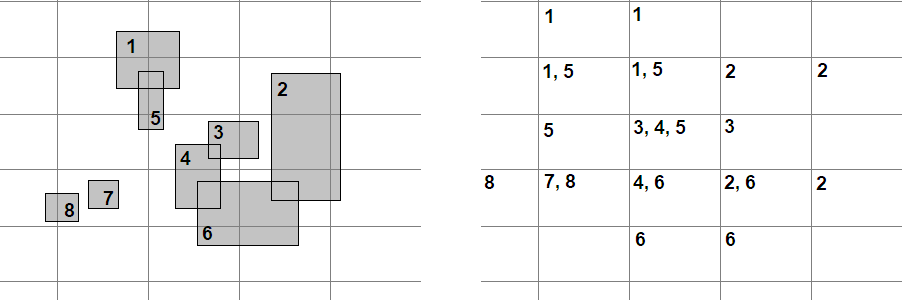

The left side shows the grid and a 8 rectangles (each of which is labeled). The
right side shows the grid and inside each cell there's a list of labels
representing which rectangles are included in that cell. For each cell, we check
for collision between rectangles in that cell's bucket.

What are the speedup gains? Well, the naive approach would take $\binom{8}{2} =
28$ comparisons, while here we only have$8$. Furhtermore, since we don't allow
duplicate collisions, this is reduced to $7$.

Grid hashing can be implemented using hash tables and tilesets. A hash table
approach is more flexible but can result in hash collisions so it's a bit
slower. A good hash function can be $h(x, y) = x * p_1 \oplus y * p_2 \mod n$
where $p_1$ and $p_2$ are prime numbers and $n$ is the hash table size, or
alternatively using Morton's space filling curve. Tilesets have a fixed range
but hashing is precise and fast since it's a 2D matrix.

Do you notice a problem with this approach? Look at the above image,
specifically rectangle $2$, and how it might miss certain collisions.
Here's a more clear example:

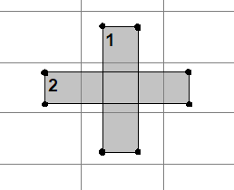

A shape that spans across more than two grid cells will not be included in the
middle cells' buckets. In the above image, rectangles $1$ and $2$ intersect in
the middle cell, but neither of them has an endpoint in that cell, so we lose
information.

Cell size is a hyperparameter, and grid hashing only works if all shapes are
smaller than a cell (in all axes). If we know ahead of time that there's a
maximum size for bounding volumes, this isn't an issue. If we don't know, then
we can scan through all the objects ahead of time and determine the largest one.
This is fine, but if there isn't an upper bound on the objects' sizes, then the
cell size can grow indefinately which results in diminished performance gains. 

An adaptive approach where the cell size isn't uniform is what we need. To do
that, a hierarchical representation of the metric space is required, and this is
done using trees.

### Quad tree 

Quad trees are a spatial data structure used to segment 2D space. The 3D analog
is the oct tree, and it works the same way.

A node in the quad tree is a rectangle representing some area in space. Objects
are added to the node until the node's capacity is reached. When that happens,
the node splits into 4 children, and each object of the node is passed to the
child whose area intersects with the object. This process repeats recursively,
or until a node reaches a certain minimum size after which splitting is no
longer possible. Leaf nodes of the quad tree are buckets containing collision
candidates.

The image below demonstrates a quad tree. The left side shows the measurable
space and all bounding boxes of the objects. Each object is labeled from $1$ to
$7$. A grid is drawn representing the quad tree split. The right side
illustrates the quad tree structure itself. We assume that the capacity of any
node is $2$. At the top of the tree is the root node, spanning the entire space.
Because there are $7 > 2$ objects covering the root node, a split occurs, and
each child (top-left, top-right, bottom-left, bottom-right) is $1/4$ the area of
its parent node. Leaf nodes are shaded and labels of objects spanning the leaf
are written underneath. The bottom-right child of the root splits once again.

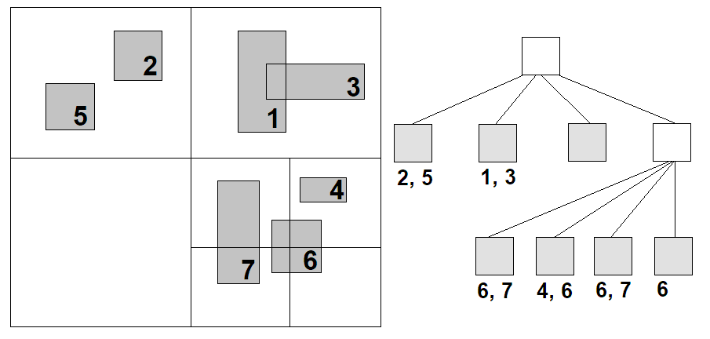

There are $5$ comparisons made in total ($4$ if you discount duplicates),
compared to the brute force solution requiring $21$ comparisons. How well a quad
tree performs depends on the capacity hyperparameter. Intuitively, we'd want to
set it to a value $c$ that maximizies the performance gain $n^2 - \frac{n}{c}
c^2$ and minimizes necessary work $\frac{n}{c} c^2 = nc$.

Quad trees adapt well to cases where we have local clusters of objects as well
as empty space between these clusters. The memory footprint of empty space is
minimal.
 
Compared to grid hashing, quad trees don't suffer from objects spanning more
than two cells (nodes) in either direction, because there's an inversion of
control happening here: in grid hashing, it's the object deciding which buckets
its belongs to; in quad trees, it's the nodes themselves deciding which objects
belong to its bucket.

Unfortunately, quad trees come with several drawbacks.
 
(1) First, they're designed for particles (no shape). Notice how in the picture
above, a single object is contained in multiple buckets. This can degenerate
into the naive approach, but such cases are rare. That said, duplicates are
extremely common and bring degradataion performance when constructing trees
since the probability of a node split increases.  
(2) Second, the previously mentioned capacity hyperparameter $c$ can make or
break broad phase optimization. If your game guarantees a sane distribution of
elements across space, $c$ is easy to compute. If the objects are large and $c$
is small, you'll quickly end up with a complete tree, split to the very end. At
that point, quad trees behave like grid hashing, with the added overhead of
constructing the tree.  
(3)  Third, you _have_ to specify the space size ahead of time. This may seem
like a non issue, and you could certainly compute these bounds in $O(n)$ for
each frame, it makes any attempt at clever optimization of $c$ impossible. Not
only that, but you have to decide the minimum allowed node size beyond which
splitting isn't allowed.

Let's take a step back and reason about where these issues with quad trees come
from. You are taking a fixed chunk of space and splitting into a non-uniform
grid. You are requiring objects to conform to this grid, no matter where they
are positioned. Constructing a quad tree seems clever because at no point does
the tree have to think which node to pass an object along, it's a matter of "you
crossed this line, so at the very least you go here". The tree is constructed
according to the space, which is constant, instead of according to the objects,
whose positions and shapes are ephemeral.

Quad trees optimize for the wrong measure: the density of objects in a unit of
space. Instead, trees should infer their shape and structure based on the
objects' natural measures, and that's what R-trees do.

### R-tree

R-trees are trees where a node can have up to $B$ children ($B$ is a
hyperparameter). Each node represents a subsegment of the space, and areas can
overlap (they can overlap in quad trees too, but only ancestor-child nodes).
R-trees can span an arbitrary space, and they the nodes cover as much space as
is needed, but not more.

The principle of R-trees is similar to quad trees: insert objects to a node,
split the node when object count overflows the capacity. Unlike quad trees,
R-trees split unevenly, trying to make the new child nodes as small as possible.

A split of an R-tree node is made by optimizing some measure, most commonly
maximizing unused area:

$$ \argmax_{N_1, N_2} Area(N \setminus (N_1 \cup N2)) $$

Take a look at the picture below. The leftmost image is an r-node (red outline)
containing $5$ objects. On the right are two different splits, labelled $A$ and
$B$, with their bounds highlighted in blue. In this example, the split $A$ would
yield a larger unused area.

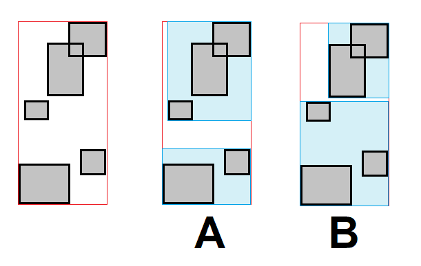

The intuition behind this is that greater unused area means more compact
bounding boxes for the two new nodes. If two objects are far apart, then the
unused area between them increases. We've already established that the
probability of intersection decreases as the objects get further and further
apart. See the image below, the $A$ split is unnatural and leads to computation
time wasted on cases which are visually obviously negative.
 
Another thing I should point out is that we can maximize/minimize the perimiter
of the rectangles instead of their areas. Think of a thin but extremely long
rectangle. Its area may not be large, but the distance of two objects along the
longer axis is large, then the algorithm will correctly split so that the two
objects cannot intersect.

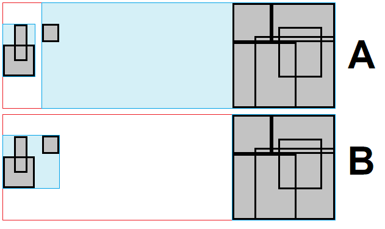

Finding the area of a union of 2D rectangles is Klee's measure problem for the
case $d=2$ which can be solved using Bentley's algorithm in $O(n\log{n})$. In fact,
it can be shown that for $d=2$, the lower bound for a solution is
$\Omega(n\log{n})$.
 
In general, there are $2^{n-1}-1$ possible ways to split an R-tree node
containing $n$ elements, where each object can be put inside one or both nodes
(the areas of child nodes can overlap).
 
Finding the optimal split therefore has an upper bound of $O(2^{n}n\log{n})$,
which isn't practical for real use cases.

In order to improve on this, we have to introduce approximations and heuristics.
These optimizations often rely on choosing two _seed_ objects as pivots for the
new nodes, and then expanding the pivots for each remaining node based on the
heuristic of minimal area expansion when inserting the object $o$: 

$$\argmin_{i \in \\{1, 2\\}} Area(N_i \cup o) $$

The original paper on R-trees introduces three such splits:

- **Linear split**: On each axis, find the two objects furthest apart on that
axis. Those two best objects are _seeds_. For every other object, greedily
insert it into the _seed_ with the minimal area expansion. Runs in $O(nd)$ in
$d$ dimensions.
- **Quadratic split**: Find the two objects with the maximum unused area:
$Area(N_i \cup N_j) - Area(N_i) - Area(N_j)$. Those two best objects are
_seeds_. For every other object, greedily insert it into the _seed_ with the
maximum unused area. Runs in $O(n^2)$.
- **Exponential split**: Same as quadratic split, but all $O(2^n)$ combinations
are attempted.

The main issue with these approximations is that they introduce overlap between
nodes, which leads to degradation of performance. The bottleneck of R-trees is
not construction, but querying. In general it is better to opt for a quadratic
split which, while more costly to create, yields fewer false positives. 

Both the quadratic and linear split result in a large overlap. There exist
variations of the R-tree that attempt to reduce this. For example, the _R*-tree_
tries to minimize the nodes' area, perimiter and total overlap between siblings.
Furthermore, it tries to evade splitting the node whenever possible by taking
the $f \in [0, 1]$ (usually $~30\\%$) furthest objects from the node's center
and reinsert them starting from the root. This idea takes inspriation from how
B-trees are balanced. R*-trees construction is far more costly, but it makes up
for quicker amortized queries because of the reduced overlap.
 
Unfortunately, R*-trees behave poorly for densly packed objects in a small
space. Because R-trees are not unique (unless we split using the optimal
approach which isn't practical), the order in which objects are inserted can
significantly impact performance.

### Bulk R-tree

Because we know our input data ahead of time, we can perform certain _bulk
loading_ mechanisms to preprocess the objects in such a way that the tree is
more optimized. 

These mechanisms have us build the tree in a bottom-up procedure, which greatly
simplifies the construction of an R-tree as we no longer have to split nodes and
re-insert objects to keep the tree sorted nor perform expensive heuristics to
reduce overlap between nodes.
 
The general idea behind all of these mechanisms is the same: leaves are built
from objects which are locally close (per the distance metric $d$), upper level
nodes are built using the same heuristics, the process repeats recursively until
we are left with a level with a single node - the root. The heuristic in this
case is an ordering function by which the objects are sorted.

**Nearest-X** is a simple bulk-loading algorithm which sorts the objects
on the $x$ axis and groups objects into segments of size $k$. A new
R-tree node is assigned to contain each group. The process repeats while $k$ is
reduced in each upper level of the tree. 

Observe the following example. There is a scene with $n=8$ objects in it, and we
set the capacity to $k=3$ (top-left image). Assume the objects have been sorted
by the x value of their centroid. The first $k=3$ objects will be grouped into
the first leaf node, the second $3$ objects into the second leaf node and the
last remaining $2$ objects into the third leaf node (top-right image, leaf node
represented by a red rectangle). There are $3$ leaves in the topmost layer in
the tree so far, so we continue with the algorithm. Now $n=3$ and
$k=\max\\{\frac{n}{k}, 2\\}=2$ ($k$ mustn't be $1$ to prevent infinite
recursion). The first two leaves are grouped in the first new node, while the
last leaf in the second node (bottom-left image, the new nodes are blue). There
are $2$ nodes in the topmost layer in the tree so far, so we continue. $n=2$ and
$k=2$. The two "blue" nodes are grouped together into a single new node of the
new layer (bottom-right image, the new node is black). There's $1$ node in the
topmost level, so it has to be the root and the algorithm is finished.

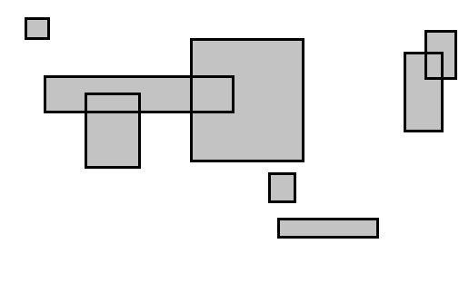
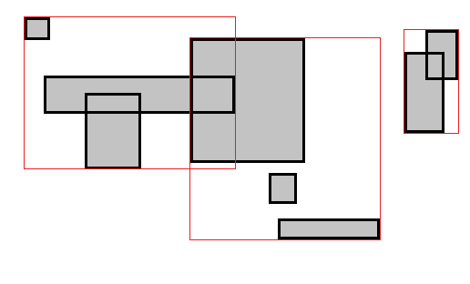
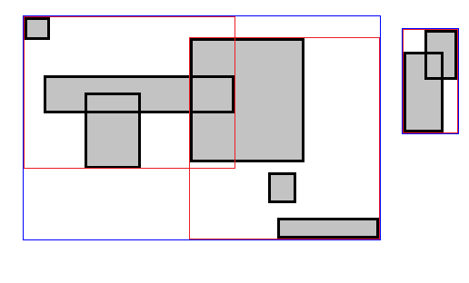
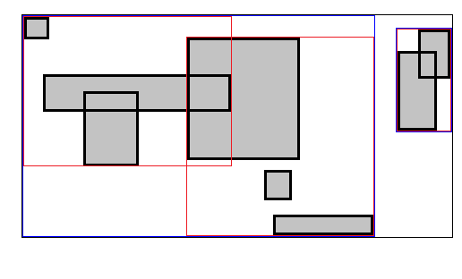